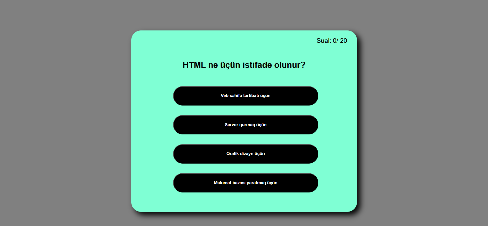

# 🧠 JavaScript Quiz App

Bu layihə, istifadəçiyə ardıcıl suallar təqdim edən və cavablara əsasən nəticəni göstərən **interaktiv quiz tətbiqidir**. Layihə HTML, CSS və JavaScript istifadə edilərək hazırlanmışdır.



## 🚀 Xüsusiyyətlər

- ✅ Birdən çox sual ilə quiz
- ✅ Cavab seçildikdən sonra növbəti sual
- ✅ Doğru cavabların sayı sonunda göstərilir
- ✅ Sadə və istifadəçi dostu dizayn

---

## 🔧 Quraşdırma

Layihəni öz kompüterinizdə işlətmək üçün bu addımları izləyin:

```bash
git clone https://github.com/OsmanliFarid/Javascript-Quiz.git
cd Javascript-Quiz
```

Sonra `index.html` faylını brauzerdə açın.

---

## 🧪 İstifadə

1. Saytı açın  
2. Suallara cavab verin  
3. Ən sonda nəticəni görün

---

## 📁 Fayl Strukturu

- `index.html` – HTML əsas skelet  
- `style.css` – Quiz üçün dizayn  
- `app.js` – Bütün funksionallıq burada yazılıb  

---

## 📚 Texnologiyalar

- HTML  
- CSS  
- JavaScript  

---

## 👨‍💻 Müəllif

- Ad: **Osmanlı Fərid**  
- GitHub: [github.com/OsmanliFarid](https://github.com/OsmanliFarid)

---

## ✅ Layihə Statusu

Bu layihə tam işləkdir. Gələcəkdə yeni suallar, vaxt limiti kimi funksiyalar əlavə edilə bilər.
